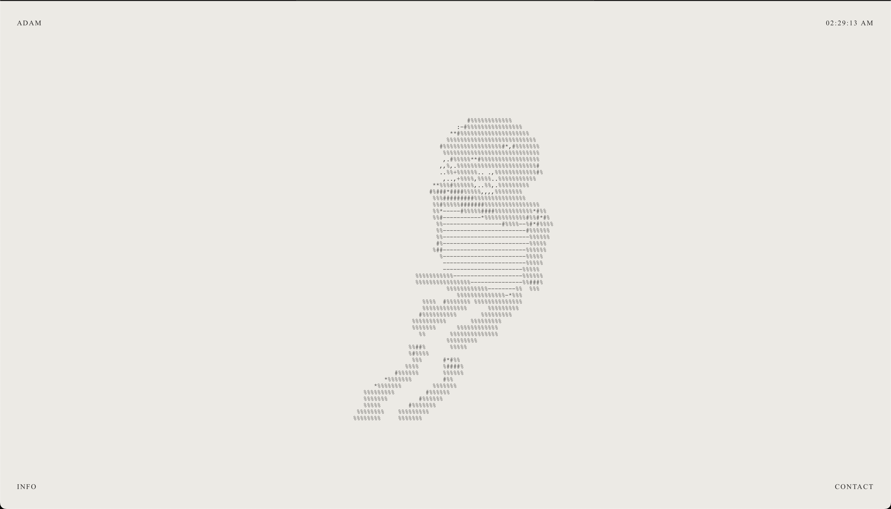
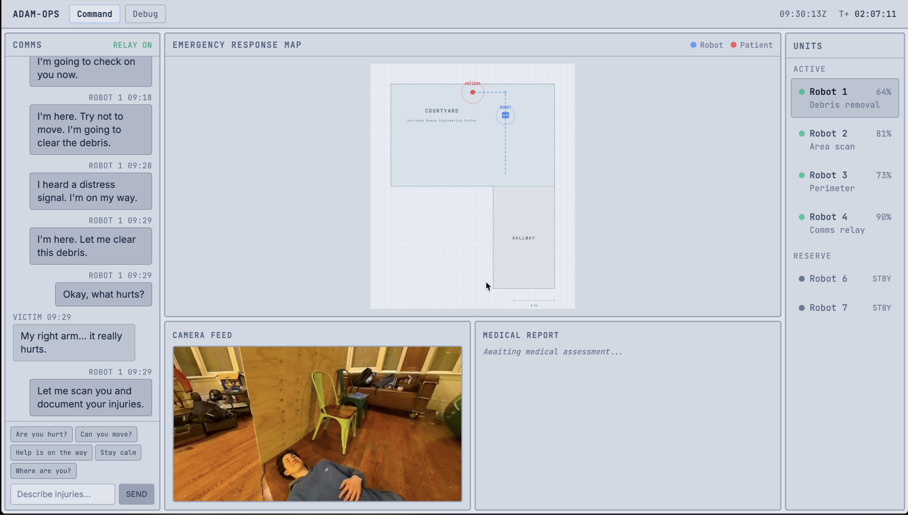
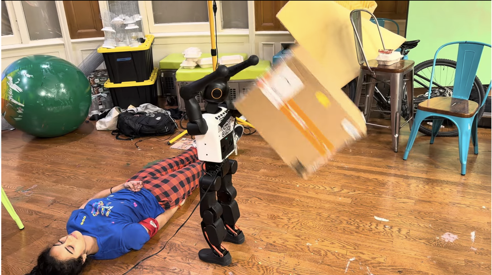
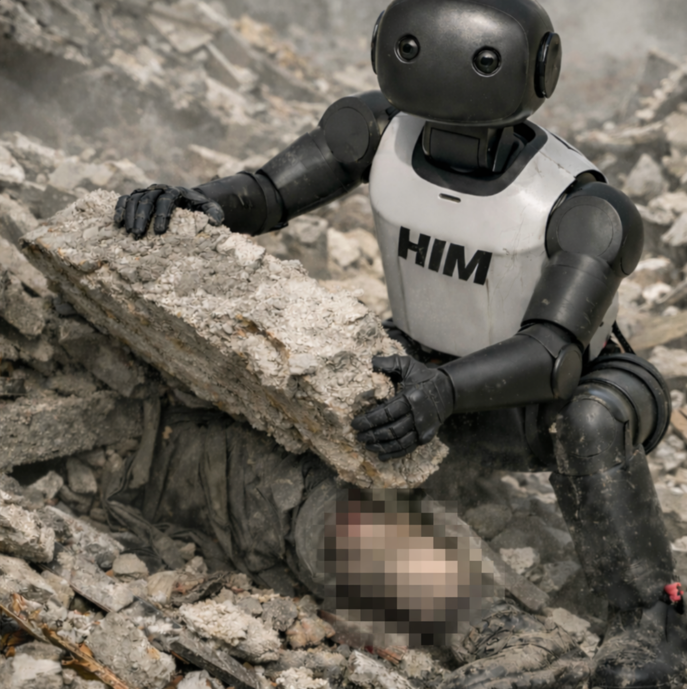

# ADAM — Autonomous Disaster Assistance Manager

> **Search-and-rescue humanoid for the Golden Hour.** TreeHacks 2026 · [adamrobotics.xyz](https://www.adamrobotics.xyz/)

**ADAM** is a humanoid robot first-responder for post-disaster triage: it locates survivors (audio + vision), assesses injuries with LLM + VLM, and streams evidence-based reports to a remote operator dashboard—so responders can act without entering dangerous terrain.

**Landing page:** [ADAM Robotics](https://www.adamrobotics.xyz/)

---

## Table of Contents

1. [System Overview](#1-system-overview)
   - 1.1 [Key Features](#key-features)
   - 1.2 [Screenshots](#screenshots)
2. [Architecture](#2-architecture)
   - 2.1 [High-Level System Diagram](#21-high-level-system-diagram)
   - 2.2 [Module Structure](#22-module-structure)
3. [Pipelines](#3-pipelines)
   - 3.1 [LLM Decision-Making Pipeline](#31-llm-decision-making-pipeline)
   - 3.2 [VLM (Vision Language Model) Pipeline](#32-vlm-vision-language-model-pipeline)
   - 3.3 [LLM Medical Diagnosis Pipeline](#33-llm-medical-diagnosis-pipeline)
   - 3.4 [Search and Rescue Pipeline](#34-search-and-rescue-pipeline)
   - 3.5 [K1 Communication Pipeline (Robot Bridge)](#35-k1-communication-pipeline-robot-bridge)
   - 3.6 [Backend + Frontend](#36-backend--frontend)
   - 3.7 [K1 Robot & Keyframes](#37-k1-robot--keyframes)
   - 3.8 [Intelligence & World Building](#38-intelligence--world-building)
4. [Setup & Installation](#4-setup--installation)
   - 4.1 [Prerequisites](#41-prerequisites)
   - 4.2 [Installation Steps](#42-installation-steps)
5. [Running the System](#5-running-the-system)
   - 5.1 [Mode A: Local (Webcam)](#51-mode-a-local-webcam--3-terminals)
   - 5.2 [Mode B: Robot (Booster K1)](#52-mode-b-robot-booster-k1--4-terminals)
   - 5.3 [Smoke Test (Robot Mode)](#53-smoke-test-robot-mode)
6. [How It All Works](#6-how-it-all-works)
   - 6.1 [End-to-End Flow (Typical Mission)](#61-end-to-end-flow-typical-mission)
   - 6.2 [Data Flows](#62-data-flows)
7. [Development Guide](#7-development-guide)
   - 7.1 [Project Structure Philosophy](#71-project-structure-philosophy)
   - 7.2 [Key Design Decisions](#72-key-design-decisions)
   - 7.3 [Adding a New Phase](#73-adding-a-new-phase)
   - 7.4 [Adding a New Perception Model](#74-adding-a-new-perception-model)
   - 7.5 [Adding a New LLM Provider](#75-adding-a-new-llm-provider)
   - 7.6 [Testing](#76-testing)
   - 7.7 [Troubleshooting](#77-troubleshooting)
   - 7.8 [Performance Notes](#78-performance-notes)
   - 7.9 [Cost Estimates (OpenAI API)](#79-cost-estimates-openai-api)
8. [Limitations](#8-limitations)
9. [Credits](#credits)

---

## 1. System Overview

This project implements an autonomous humanoid robot for search and rescue operations. The robot can:

- **Search & Navigate**: Autonomously search for victims, call out, listen for responses, navigate to sound sources
- **Medical Triage**: Perform visual injury detection using VLM (Vision Language Models), conduct dialogue-based triage assessment
- **Documentation**: Generate comprehensive medical reports with evidence provenance
- **Operator Interface**: Stream telemetry, video, and communications to a web-based command center
- **Autonomous Decision Making**: LLM-driven policy for high-level decisions, reflex controller for safety

### Key Features

- **Zero ROS2 Dependencies on Laptop**: Python-orchestrator-first architecture
- **Multimodal AI**: GPT-4o-mini for decisions, YOLO-World for open-vocabulary detection, MediaPipe for pose estimation
- **Evidence-Based Reports**: Every claim in medical reports is traceable to sensor data with confidence scores
- **Real-Time Command Center**: React webapp with live video feed, comms log, floor plan, operator messaging
- **Keyframe System**: Event-triggered frame capture (not continuous recording) for efficient storage and transmission

### Screenshots

| [Landing page](https://www.adamrobotics.xyz/) | Operator dashboard |
|-----------------------------------------------|--------------------|
|       |  |

| YOLO-World debris detection | Generated medical report |
|-----------------------------|---------------------------|
|        |  |

**End-to-end flow (building intuition):**



---

## 2. Architecture

### 2.1 High-Level System Diagram

```
┌──────────────────────────────────────────────────────────────────────────────┐
│  OPERATOR CONSOLE (React + Vite)                                             │
│  • Live camera feed                                                          │
│  • Communications log (victim/robot/operator messages)                       │
│  • Floor plan with robot position                                            │
│  • Send messages → robot speaks them                                         │
└────────────────────────────┬─────────────────────────────────────────────────┘
                             │ HTTP Polling (/latest, /snapshot/latest)
                             │ POST /operator-message
                             ▼
┌──────────────────────────────────────────────────────────────────────────────┐
│  COMMAND CENTER (FastAPI Server)                                             │
│  • Receives telemetry from robot (phase, detections, map position)           │
│  • Stores keyframe snapshots (JPEG)                                          │
│  • Buffers operator messages for robot to poll                               │
│  • Serves /latest, /snapshot/latest, /operator-messages endpoints            │
└────────────────────────────┬─────────────────────────────────────────────────┘
                             │ HTTP (POST events/snapshots, GET operator msgs)
                             ▼
┌──────────────────────────────────────────────────────────────────────────────┐
│  ORCHESTRATOR (Python Agent on Laptop)                                       │
│  ┌───────────────────────────────────────────────────────────────┐           │
│  │ PERCEPTION LAYER                                              │           │
│  │ • YOLO person detection                                       │           │
│  │ • YOLO-World open-vocab rubble detection                      │           │
│  │ • MediaPipe pose estimation                                   │           │
│  │ • Audio scanner (direction finding)                           │           │
│  │ • Medical VLM (injury classification via GPT-4-Vision)        │           │
│  └───────────────────────────────────────────────────────────────┘           │
│  ┌───────────────────────────────────────────────────────────────┐           │
│  │ DECISION MAKING (Two-Layer Brain)                             │           │
│  │ • Reflex Controller (~10-20 Hz): Safety overrides             │           │
│  │ • LLM Policy (~1 Hz): GPT-4o-mini for high-level decisions    │           │
│  │   - Input: World state (phase, detections, transcript, etc)   │           │
│  │   - Output: Action, say/ask text, params, confidence          │           │
│  └───────────────────────────────────────────────────────────────┘           │
│  ┌───────────────────────────────────────────────────────────────┐           │
│  │ MEDICAL PIPELINE                                              │           │
│  │ • TriagePipeline: coordinates all medical subsystems          │           │
│  │ • MedicalAssessor: VLM-based injury detection                 │           │
│  │ • EvidenceCollector: rolling buffer of frames                 │           │
│  │ • QuestionPlanner: dynamic triage questions                   │           │
│  │ • ReportBuilder: structured medical reports (Markdown + PDF)  │           │
│  └───────────────────────────────────────────────────────────────┘           │
│  ┌───────────────────────────────────────────────────────────────┐           │
│  │ COMMS & TELEMETRY                                             │           │
│  │ • EventManager: keyframe capture on events                    │           │
│  │ • CommandCenterClient: POST events/snapshots                  │           │
│  │ • Operator message polling loop                               │           │
│  └───────────────────────────────────────────────────────────────┘           │
└────────────────────────────┬─────────────────────────────────────────────────┘
                             │ HTTP to Robot Bridge (:9090)
                             ▼
┌──────────────────────────────────────────────────────────────────────────────┐
│  K1 ROBOT (Booster Humanoid)                                                 │
│  ┌───────────────────────────────────────────────────────────────┐           │
│  │ ROBOT BRIDGE SERVER (FastAPI on Robot)                        │           │
│  │ • Camera: ROS2 subscriber → /StereoNetNode/rectified_image    │           │
│  │ • Mic: ALSA (arecord) → 16kHz mono WAV                        │           │
│  │ • Speaker: TTS via espeak | paplay                            │           │
│  │ • Motion: Booster SDK (B1LocoClient) - walk, turn, head pan   │           │
│  │ • Endpoints: /frame, /speak, /record, /velocity, /stop        │           │
│  └───────────────────────────────────────────────────────────────┘           │
│  • Robot IP: 192.168.10.102 (USB-C Ethernet)                                 │
│  • Laptop IP: 192.168.10.1                                                   │
└──────────────────────────────────────────────────────────────────────────────┘
```

### 2.2 Module Structure

```
treehacks2026/
├── himpublic-py/              # Main Python orchestrator (NO ROS2)
│   ├── src/himpublic/
│   │   ├── main.py            # Entrypoint (CLI, signal handling)
│   │   ├── orchestrator/      # Agent, state machine, phases, policy
│   │   │   ├── agent.py       # Always-on agent with async tasks
│   │   │   ├── phases.py      # Phase enum and definitions
│   │   │   ├── policy.py      # ReflexController, LLMPolicy, Decision
│   │   │   ├── llm_adapter.py # GPT-4o-mini integration
│   │   │   ├── dialogue_manager.py  # Triage dialogue state machine
│   │   │   ├── events.py      # EventManager for keyframes
│   │   │   └── search_phase.py # Audio-guided search implementation
│   │   ├── medical/           # Medical triage CV + dialogue
│   │   │   ├── triage_pipeline.py  # Coordinator for all medical subsystems
│   │   │   ├── medical_assessor.py # VLM injury detection (GPT-4-Vision)
│   │   │   ├── evidence_collector.py # Rolling frame buffer
│   │   │   ├── question_planner.py   # Dynamic triage questions
│   │   │   ├── report_builder.py     # Structured medical reports
│   │   │   └── schemas.py     # Finding, TriageReport data models
│   │   ├── perception/        # Computer vision
│   │   │   ├── person_detector.py    # YOLOv8 (COCO-80)
│   │   │   ├── openvocab.py   # YOLO-World (open-vocabulary rubble)
│   │   │   ├── audio_scanner.py # Audio direction finding
│   │   │   ├── frame_store.py # LatestFrameStore + RingBuffer
│   │   │   └── types.py       # Observation dataclass
│   │   ├── io/                # Hardware abstraction
│   │   │   ├── robot_interface.py  # Protocol definition
│   │   │   ├── mock_robot.py       # Local dev mock
│   │   │   ├── robot_client.py     # HTTP client for bridge
│   │   │   ├── video_source.py     # Webcam/File/Robot sources
│   │   │   └── audio_io.py         # Local/Robot audio I/O
│   │   ├── comms/             # Command center communication
│   │   │   ├── command_center_server.py  # FastAPI server
│   │   │   └── command_center_client.py  # HTTP client
│   │   ├── reporting/         # Evidence-based report generation
│   │   │   ├── render_medical_report.py
│   │   │   ├── report_builder.py
│   │   │   ├── document_builder.py
│   │   │   └── artifact_store.py
│   │   ├── planner/           # LLM planner-executor (optional)
│   │   │   ├── llm_planner.py
│   │   │   ├── executor.py
│   │   │   └── schema.py
│   │   ├── pipeline/          # Strict sequential mission pipeline
│   │   │   ├── engine.py
│   │   │   ├── phases.py
│   │   │   └── cli.py
│   │   └── utils/
│   ├── scripts/
│   │   ├── run_command_center.py
│   │   ├── smoke_test_robot.py
│   │   └── run_search_demo.py
│   ├── code/                  # Demo scripts and experiments
│   │   ├── final_demo.py
│   │   ├── hardcoded_demo.py
│   │   └── walk_demo_*.py
│   └── docs/                  # Architecture docs
│       ├── ARCHITECTURE.md
│       ├── PIPELINE.md
│       ├── ROBOT_INTEGRATION.md
│       └── MEDICAL_REPORT_SPEC.md
├── webapp/                    # React operator console
│   ├── src/
│   │   ├── App.tsx            # Main dashboard
│   │   ├── components/        # Chat, FloorPlan, RobotStatus, etc.
│   │   └── api/client.ts      # Command center API client
│   ├── package.json
│   └── vite.config.ts
├── booster_robotics_sdk/      # Official Booster SDK (reference)
├── no-robot-sim/              # Wizard-of-Oz demo (keyboard-driven)
└── docs/
    ├── STARTUP_GUIDE.md       # What to run, in what order
    └── ARCHITECTURE.md        # Full-stack architecture
```

---

## 3. Pipelines

### 3.1 LLM Decision-Making Pipeline

**Goal**: High-level autonomous decision making for navigation, dialogue, and phase transitions.

**How It Works**:
1. **World State Construction**: Every tick (~1 Hz), the orchestrator builds a compact JSON snapshot:
   - Current phase (search, approach, triage, etc.)
   - Observations: detected persons, rubble, audio cues
   - Conversation history (last 10 exchanges)
   - Robot constraints (safety limits, available tools)
   - Triage state (questions asked, answers collected)

2. **LLM Call** (GPT-4o-mini):
   ```python
   prompt = f"""
   You are controlling a search and rescue robot.
   
   Current state:
   {json.dumps(world_state, indent=2)}
   
   Available actions: {allowed_actions_for_phase}
   
   Decide next action. Output JSON:
   {{
     "action": "rotate_left|wait|ask|say|...",
     "say": "optional text to speak",
     "ask": "optional question to ask victim",
     "params": {{}},
     "rationale": "why you chose this",
     "confidence": 0.0-1.0
   }}
   """
   
   response = openai.ChatCompletion.create(
       model="gpt-4o-mini",
       messages=[{"role": "system", "content": prompt}],
       temperature=0.7,
   )
   decision = parse_llm_json(response)
   ```

3. **Validation & Execution**:
   - Check action is allowed for current phase (e.g., `push_obstacle` only in DEBRIS_CLEAR)
   - Clamp params (rotation degrees, wait duration) to safety bounds
   - Dispatch action (e.g., `robot.set_velocity()`, `audio.speak()`)
   - Log decision to `logs/llm_decisions.jsonl`

4. **Reflex Override**: A separate controller (~10-20 Hz) can override the LLM:
   - Stop if obstacle too close (< 0.5m)
   - Rotate to center person if offset > 0.3

**Located In**: `himpublic-py/src/himpublic/orchestrator/policy.py`, `llm_adapter.py`

---

### 3.2 VLM (Vision Language Model) Pipeline

**Goal**: Detect injuries from camera frames using multimodal vision-language models.

**Components**:

#### a) YOLO-World (Open-Vocabulary Detection)
- Detects rubble/obstacles using free-form text prompts
- **Why**: Standard YOLOv8 only knows 80 COCO classes; "cardboard box", "rubble", "debris" are not included
- **Prompts**: `["cardboard box", "amazon box", "package", "debris", "rubble", ...]`
- **Model**: `yolov8s-worldv2` (built into `ultralytics` package)
- **Located In**: `himpublic-py/src/himpublic/perception/openvocab.py`

#### b) Medical VLM (GPT-4-Vision)
- Analyzes frames for visible injuries (bleeding, burns, fractures, etc.)
- **Input**: BGR frame + optional pose keypoints (MediaPipe)
- **Prompt**: 
  ```
  Analyze this image for visible injuries. Look for:
  - Bleeding (arterial/venous)
  - Burns
  - Fractures or deformities
  - Contusions
  - Lacerations
  
  If pose keypoints provided, cross-reference body regions.
  
  Output JSON:
  [
    {
      "finding_type": "bleeding|burn|fracture|...",
      "body_region": "left_forearm|right_knee|...",
      "severity": "mild|moderate|severe",
      "confidence": 0.0-1.0,
      "rationale": "explanation"
    }
  ]
  ```
- **Located In**: `himpublic-py/src/himpublic/medical/medical_assessor.py`

#### c) MediaPipe Pose
- Extracts 33 body landmarks (nose, shoulders, elbows, knees, etc.)
- Used to guide VLM's attention to specific body regions
- Helps disambiguate "left arm" vs "right arm" from camera perspective

**Pipeline Flow**:
```
Frame (BGR) → MediaPipe Pose → 33 keypoints
                                    ↓
Frame (JPEG) + keypoints → GPT-4-Vision → Findings (JSON)
                                    ↓
Findings → TriagePipeline → Evidence collector → Report builder
```

**Located In**: `himpublic-py/src/himpublic/medical/triage_pipeline.py`

---

### 3.3 LLM Medical Diagnosis Pipeline

**Goal**: Structured medical triage through dialogue + visual assessment.

**Phases**:

#### Phase 1: Visual Assessment (SCAN_CAPTURE)
1. Robot captures 4 views: front, left, right, close-up
2. Each frame → MedicalAssessor (VLM) → Findings
3. Findings accumulated with confidence scores
4. If confidence ≥ 0.55: trigger evidence collection

#### Phase 2: Dialogue Triage (TRIAGE_INTERVIEW)
1. **Question Planner** generates questions based on:
   - Visual findings (e.g., if bleeding detected → "Where is the bleeding?")
   - Standard triage protocol (consciousness, pain scale, allergies)
   - Previous answers (follow-ups)

2. **Dialogue Manager** state machine:
   - Tracks current question, retries (if no answer), follow-ups
   - Integrates speech recognition (ASR) via robot mic
   - Parses free-form answers using LLM:
     ```python
     prompt = f"""
     Question: "{question}"
     Victim's answer: "{transcript}"
     
     Extract structured data:
     {{
       "pain_scale": 0-10,
       "injury_location": "left knee",
       "mobility": "cannot_walk|limited|mobile",
       ...
     }}
     """
     ```

3. **Example Flow**:
   ```
   Robot: "Can you hear me? Are you conscious?"
   Victim: "Yes, I'm awake."
   → triage_answers["consciousness"] = "alert"
   
   Robot: "On a scale of 1-10, how much pain are you in?"
   Victim: "Maybe a 7."
   → triage_answers["pain_scale"] = 7
   
   Robot: "Where are you hurt?"
   Victim: "My left knee is bleeding."
   → triage_answers["injury_location"] = "left_knee"
   → medical_pipeline.set_spoken_body_region("left_knee")
   ```

#### Phase 3: Report Generation (REPORT_SEND)
1. Compile all evidence:
   - Visual findings (with confidence scores)
   - Dialogue transcript
   - Triage answers (structured)
   - Keyframe images

2. **ReportBuilder** generates:
   - **Markdown**: Human-readable report with sections:
     - Incident meta (timestamp, robot ID, location)
     - Patient summary (age estimate, consciousness, primary concern)
     - ABCDE findings (Airway, Breathing, Circulation, Disability, Exposure)
     - Suspected injuries (with evidence IDs)
     - Hazards nearby
     - Media evidence (images with captions)
     - Evidence & Provenance table (every claim traceable to sensor data)
     - Recommended actions
   - **PDF**: Generated via `md_to_pdf.py` (uses `markdown` + `pdfkit`)

3. **Evidence Log** (JSONL):
   - Every image, audio snippet, model output gets a unique ID (E1, E2, ...)
   - Reports cite evidence: "Possible arterial bleed [E12][E14]"
   - Enables audit trail and confidence tracking

**Located In**:
- `himpublic-py/src/himpublic/orchestrator/dialogue_manager.py`
- `himpublic-py/src/himpublic/medical/question_planner.py`
- `himpublic-py/src/himpublic/reporting/render_medical_report.py`

---

### 3.4 Search and Rescue Pipeline

**Goal**: Autonomous search for victims in unknown environment, guided by audio cues.

**Phases**:

#### Phase 1: SEARCH_LOCALIZE
- Robot patrols/rotates, calling out: "Where are you? Can you hear me?"
- **Audio Scanner** listens for voice responses and localizes sound direction (see [Sound-based localization](#sound-based-localization) below).
- **Person Detector** (YOLO) scans video for humans
- **Exit Condition**: Person detected with confidence ≥ 0.7 OR audio response heard

**Sub-states**:
- `announce`: Call out, wait 5s
- `listen`: Record audio, run ASR + direction finding
- `navigate_to_sound`: Rotate toward bearing, walk forward

**Flow**:
```
announce → listen (3s) → ASR
                    ↓
         Voice detected? → Direction finding → bearing
                    ↓
         Rotate toward bearing → walk forward
                    ↓
         YOLO detects person? → APPROACH_CONFIRM
```

#### Phase 2: APPROACH_CONFIRM
- Navigate to detected person
- Re-detect to confirm (not a false positive)
- Establish safe standoff distance (~1.5m)
- Announce: "I'm a rescue robot. I'm here to help."

#### Phase 3: DEBRIS_CLEAR (optional)
- YOLO-World scans for obstacles between robot and victim
- If movable (confidence check) → attempt to push/clear
- If not movable → mark as "blocked_not_clearable" and proceed

#### Phase 4: SCENE_SAFETY_TRIAGE
- Scan for hazards: fire, smoke, unstable debris, water
- Choose camera viewpoints for injury scan

**Located In**:
- `himpublic-py/src/himpublic/orchestrator/search_phase.py`
- `himpublic-py/src/himpublic/perception/audio_scanner.py`
- `himpublic-py/src/himpublic/perception/person_detector.py`
- `himpublic-py/src/himpublic/perception/openvocab.py`

#### Sound-based localization

We localize the victim by **spin-to-peak loudness**, not by stereo microphone array:

1. **Call out** — Robot announces ("Is anyone there? Can you hear me?") and waits for a response.
2. **360° scan** — Robot rotates in fixed steps (e.g. 30°). At each heading it records a short audio window (~0.4 s), then turns to the next angle until a full rotation is done.
3. **Per-window signal** — For each window we compute **RMS** (root-mean-square energy) and **VAD** (voice activity detection via webrtcvad or energy threshold). A composite score combines loudness and voice likelihood.
4. **Best bearing** — Scores are smoothed over adjacent angles (to reduce spikes), then the heading with the highest score is chosen as the estimated bearing to the sound source. Confidence is derived from how much that peak stands out above the mean.
5. **Navigate** — Robot rotates toward the chosen bearing and walks forward; YOLO person detection then refines approach.

So localization is **directional hearing by physical rotation**: we infer "sound came from that way" by which orientation had the loudest voice-like audio. No stereo phase or time-difference math—just turn, listen, and pick the loudest direction.

**Located In**: `himpublic-py/src/himpublic/perception/audio_scanner.py`

---

### 3.5 K1 Communication Pipeline (Robot Bridge)

**Goal**: Abstract all robot hardware (camera, mic, speaker, motion) behind HTTP endpoints. Laptop orchestrator has ZERO ROS2 dependencies.

**Why**: 
- K1 robot runs Ubuntu 22.04 with ROS2 Humble + Booster SDK
- Camera is locked by `booster-daemon-perception.service` (cannot use OpenCV directly)
- Audio requires specific ALSA/PulseAudio incantations
- We want to develop on laptop (macOS/Windows/WSL) without ROS2

**Architecture**:
```
Laptop Orchestrator                       K1 Robot (192.168.10.102)
--------------------                      --------------------------
RobotBridgeClient                         FastAPI Server (:9090)
  ↓ HTTP GET /frame                         ↓ ROS2 Subscriber
  ↓                                           /StereoNetNode/rectified_image
  ↓                                         ↓ YUV NV12 → BGR
  ↓                                         ↓ cv2.imencode(.jpg)
  ↓ ← JPEG bytes                          ↑ Return JPEG
  
  ↓ HTTP POST /speak {"text": "..."}      ↓ espeak --stdout | paplay
  
  ↓ HTTP POST /record {"duration": 5}     ↓ arecord -d 5 /tmp/audio.wav
  ↓ ← WAV bytes                           ↑ Return WAV
  
  ↓ HTTP POST /velocity {"vx": 0.2}       ↓ Booster SDK B1LocoClient
```

**Bridge Endpoints**:

| Endpoint | Method | Purpose | Implementation |
|----------|--------|---------|----------------|
| `/health` | GET | Status check | Returns camera_ok, SDK availability, uptime |
| `/state` | GET | Telemetry | Robot joint angles, IMU, SDK members |
| `/frame?quality=80` | GET | Camera frame | ROS2 subscriber → JPEG (544×448) |
| `/speak` | POST | Text-to-speech | `espeak --stdout "text" \| paplay` |
| `/play_audio` | POST | Play WAV | `paplay` from bytes |
| `/record` | POST | Record mic | `arecord -f S16_LE -r 16000 -c 1 -d N` |
| `/velocity` | POST | Motion command | `B1LocoClient.Move(vx, vy, vyaw)` (requires `--allow-motion` flag) |
| `/stop` | POST | Emergency stop | Always allowed, no flag needed |

**Key Implementation Details**:

1. **Camera** (ROS2 Subscriber):
   ```python
   from rclpy.node import Node
   from sensor_msgs.msg import Image
   
   class CameraManager(Node):
       def __init__(self):
           super().__init__('camera_bridge')
           self.subscription = self.create_subscription(
               Image,
               '/StereoNetNode/rectified_image',  # NO /booster_camera_bridge/ prefix!
               self.image_callback,
               10
           )
       
       def image_callback(self, msg):
           # YUV NV12 → BGR
           yuv = np.frombuffer(msg.data, dtype=np.uint8).reshape((msg.height, msg.width))
           bgr = cv2.cvtColor(yuv, cv2.COLOR_YUV2BGR_NV12)
           self.latest_frame = bgr
   ```

2. **TTS** (espeak + paplay):
   ```python
   # WRONG (hangs forever):
   subprocess.run(["espeak", text])
   
   # CORRECT:
   espeak_proc = subprocess.Popen(
       ["espeak", "--stdout", "-a", "200", text],
       stdout=subprocess.PIPE
   )
   paplay_proc = subprocess.Popen(
       ["paplay"],
       stdin=espeak_proc.stdout
   )
   paplay_proc.wait()
   ```

3. **Mic** (arecord):
   ```python
   subprocess.run([
       "arecord",
       "-D", "default",
       "-f", "S16_LE",
       "-r", "16000",
       "-c", "1",
       "-d", str(duration),
       wav_path
   ])
   with open(wav_path, "rb") as f:
       return f.read()
   ```

4. **Motion** (Booster SDK):
   ```python
   import booster_robotics_sdk_python as sdk
   
   channel = sdk.ChannelFactory.Instance().CreateSendChannel(
       sdk.ChannelPublisher, sdk.SERV_LOCO
   )
   loco_client = sdk.B1LocoClient(channel)
   loco_client.SetApiId(sdk.B1LocoApiId.kMove)
   req = sdk.B1LocoRequest()
   req.vx, req.vy, req.vyaw = vx, vy, vyaw
   req.duration = 0  # continuous
   loco_client.Move(req)
   ```

**Deployment**:
```bash
# Copy server to robot (FROM LAPTOP, NOT SSH):
scp himpublic-py/src/robot_bridge/server.py booster@192.168.10.102:~/server.py

# Start bridge (ON ROBOT):
ssh booster@192.168.10.102
source /opt/ros/humble/setup.bash && python3 ~/server.py
```

**Located In**:
- Bridge server: `himpublic-py/src/robot_bridge/server.py`
- Client: `himpublic-py/src/himpublic/io/robot_client.py`
- Smoke test: `himpublic-py/scripts/smoke_test_robot.py`

---

### 3.6 Backend + Frontend

#### Backend (Command Center — FastAPI)

**Purpose**: Hub for telemetry, keyframes, operator messaging.

**Endpoints**:

| Endpoint | Method | From | To | Purpose |
|----------|--------|------|-----|---------|
| `/event` | POST | Orchestrator | Server | Telemetry (heartbeat with phase, detections, robot_map_x/y), heard_response (transcript), robot_said (TTS text) |
| `/snapshot` | POST | Orchestrator | Server | Upload JPEG keyframe; server stores to disk and sets latest_snapshot_path |
| `/report` | POST | Orchestrator | Server | Upload medical report JSON |
| `/operator-message` | POST | Webapp | Server | Operator text; server appends to comms log and operator queue |
| `/latest` | GET | Webapp | Server | Last event, snapshot_path, report, comms (victim/robot/operator), robot_map_x/y |
| `/snapshot/latest` | GET | Webapp | Server | Latest JPEG for live feed |
| `/operator-messages` | GET | Orchestrator | Server | Queue of operator messages for robot to speak |
| `/operator-messages/ack` | POST | Orchestrator | Server | Clear messages up to index after speaking |

**Data Flow (Comms)**:
```
1. Robot hears victim:
   Orchestrator → POST /event {"event": "heard_response", "transcript": "..."}
   → Server appends to comms: {"role": "victim", "text": "..."}
   → Webapp polls GET /latest → displays as VICTIM message

2. Robot says something:
   Orchestrator → TTS.speak(text) + POST /event {"event": "robot_said", "text": "..."}
   → Server appends to comms: {"role": "robot", "text": "..."}
   → Webapp polls GET /latest → displays as ROBOT 1 message

3. Operator sends message:
   Webapp → POST /operator-message {"text": "Tell them help is on the way"}
   → Server appends to comms: {"role": "operator", "text": "..."}
   → Server appends to operator queue
   → Orchestrator polls GET /operator-messages → TTS.speak(text)
   → Orchestrator → POST /operator-messages/ack
```

**Located In**: `himpublic-py/src/himpublic/comms/command_center_server.py`

#### Frontend (Webapp — React + Vite)

**Tech Stack**:
- React 19
- TypeScript
- Vite (dev server + build)
- Tailwind CSS 4

**Components**:

1. **Chat** (`components/Chat.tsx`):
   - Displays comms log: victim (green), robot (blue), operator (gray)
   - Quick-reply buttons: "Help is coming", "Stay calm", "Can you move?"
   - Text input for custom messages

2. **FloorPlan** (`components/FloorPlan.tsx`):
   - SVG floor plan with rooms, corridors
   - Robot marker (blue circle) at `(robot_map_x, robot_map_y)` from telemetry
   - Path line showing robot's trajectory
   - **Map position is simulated** (no real odometry):
     - SEARCH_LOCALIZE: robot drifts along corridor
     - APPROACH_CONFIRM: robot moves toward victim at (68, 58)

3. **RobotFeed** (`components/RobotFeed.tsx`):
   - Polls `GET /snapshot/latest?t={timestamp}` every 2s
   - Displays live JPEG from robot camera
   - Keyframes are event-triggered (FOUND_PERSON, HEARD_RESPONSE, HEARTBEAT)

4. **RobotStatus** (`components/RobotStatus.tsx`):
   - Phase badge (SEARCH, APPROACH, TRIAGE, REPORT)
   - Detections: persons, rubble, audio cues
   - Last decision from LLM

5. **API Client** (`api/client.ts`):
   ```typescript
   export async function getLatest() {
     const res = await fetch('/api/latest');
     return res.json();
   }
   
   export async function sendOperatorMessage(text: string) {
     await fetch('/api/operator-message', {
       method: 'POST',
       headers: { 'Content-Type': 'application/json' },
       body: JSON.stringify({ text })
     });
   }
   
   export function getSnapshotUrl() {
     return `/api/snapshot/latest?t=${Date.now()}`;
   }
   ```

**Dev Server Proxy** (`vite.config.ts`):
```typescript
export default defineConfig({
  server: {
    proxy: {
      '/api': {
        target: 'http://127.0.0.1:8000',
        changeOrigin: true,
        rewrite: (path) => path.replace(/^\/api/, '')
      }
    }
  }
})
```

**Located In**: `webapp/src/`

---

### 3.7 K1 Robot & Keyframes

#### Hardware Specs
- **Model**: Booster K1 Humanoid
- **OS**: Ubuntu 22.04.2 LTS (aarch64)
- **ROS**: ROS2 Humble
- **SDK**: `booster_robotics_sdk_python` (compiled .so, not pip-installable)
- **Camera**: Stereo camera (544×448), published on ROS2 topic
- **Audio**: USB Audio Device (card 0), PulseAudio sink
- **Joints**: 23 DOF (head, arms, waist, legs, hands)

#### Network Setup
- **Robot IP**: 192.168.10.102 (USB-C Ethernet)
- **Laptop IP**: 192.168.10.1
- **SSH**: `ssh booster@192.168.10.102` (password: `123456`)

#### Keyframe System

**Why Not Continuous Recording?**
- Continuous video at 30 FPS → ~2 GB/hour (H.264)
- Unnecessary: only need frames at decision points / events
- Network overhead: USB-C Ethernet is fast, but streaming HD video continuously is wasteful

**How It Works**:

1. **RingBuffer** (Rolling Frame Store):
   - Configurable window: `--ring-seconds 10` (default)
   - Sample rate: `--ring-fps 2` (default)
   - Stores: `(timestamp, jpeg_bytes, observation_summary)`
   - Memory-efficient: JPEG compression (quality 85), ~60 KB per frame
   - 10s window at 2 FPS = 20 frames = ~1.2 MB RAM

2. **EventManager** (Triggers):
   - `FOUND_PERSON`: First confident person detection
   - `HEARD_RESPONSE`: Victim voice detected
   - `POSSIBLE_INJURY`: Visual injury detection confidence ≥ 0.55
   - `OPERATOR_REQUEST`: Operator message received
   - `HEARTBEAT`: Throttled (every 30s by default)

3. **Keyframe Selection** (on event):
   ```python
   def get_keyframes(k=3, strategy="spread"):
       # Get last 10s of frames from RingBuffer
       window = self.ring_buffer.get_window(seconds_back=10)
       
       if strategy == "spread":
           # Evenly space k frames across window
           indices = np.linspace(0, len(window)-1, k, dtype=int)
           return [window[i] for i in indices]
       
       elif strategy == "confidence":
           # Pick frames with highest person detection confidence
           sorted_frames = sorted(window, key=lambda f: f.obs.confidence, reverse=True)
           return sorted_frames[:k]
   ```

4. **Storage & Transmission**:
   - Save to disk: `data/snapshots/{timestamp}_{event}.jpg`
   - POST to command center: `/snapshot` (multipart/form-data)
   - Command center stores: `./data/snapshots/` (served via `/snapshot/latest`)

**Example Event**:
```
[PERCEPTION] Person detected (confidence 0.82)
  → EventManager.emit(FOUND_PERSON, meta={"confidence": 0.82})
  → get_keyframes(k=3, strategy="spread")
  → Save: data/snapshots/1708022345_found_person_0.jpg (3 frames)
  → POST /snapshot (3 requests)
  → Command center: latest_snapshot_path = ".../found_person_2.jpg"
  → Webapp: GET /snapshot/latest → displays keyframe
```

**Located In**:
- RingBuffer: `himpublic-py/src/himpublic/perception/frame_store.py`
- EventManager: `himpublic-py/src/himpublic/orchestrator/events.py`

---

### 3.8 Intelligence & World Building

#### World State Representation

The orchestrator maintains a **SharedState** dataclass that represents the robot's understanding of the world:

```python
@dataclass
class SharedState:
    # Phase & timing
    phase: Phase
    phase_entered_at: float
    tick: int
    
    # Perception
    latest_observation: Observation | None
    num_persons: int
    person_confidence: float
    primary_person_offset: float  # [-1, 1], 0 = centered
    obstacle_distance_m: float
    
    # Audio
    last_heard_transcript: str | None
    audio_bearing_deg: float | None  # Direction to sound source
    
    # Medical triage
    triage_step_index: int
    triage_answers: dict  # {"pain_scale": 7, "injury_location": "left_knee", ...}
    consent_for_photos: bool | None
    visual_findings: list[Finding]
    
    # Dialogue
    pending_question_id: str | None
    pending_question_text: str | None
    pending_question_asked_at: float | None
    pending_question_retries: int
    conversation_transcript: list[str]
    
    # Navigation (simulated in local mode)
    robot_map_x: float
    robot_map_y: float
    robot_heading_deg: float
    
    # Degraded mode
    degraded_mode: bool
    sensor_failures: set[str]
```

#### Phase Transitions (Strict Sequential)

The mission follows a **strict, reproducible phase order**:

```
BOOT
  ↓ (sensors OK)
SEARCH_LOCALIZE
  ↓ (person detected OR voice heard)
APPROACH_CONFIRM
  ↓ (standoff established)
SCENE_SAFETY_TRIAGE
  ↓ (hazards assessed)
DEBRIS_ASSESSMENT (optional)
  ↓ (access improved OR not movable)
SCAN_CAPTURE
  ↓ (4 views captured: front, left, right, close-up)
TRIAGE_INTERVIEW
  ↓ (questions answered OR timeout)
REPORT_SEND
  ↓ (report sent)
MONITOR_WAIT
  ↓ (operator handoff OR mission command)
DONE
```

**No skipping, reordering, or ad-hoc transitions** unless `--force_phase X` override is used (logged as deliberate override).

#### Intelligence Layers

**Layer 1: Reflex Controller** (~10-20 Hz)
- Input: Latest observation (obstacle distance, person offset)
- Output: Safety override (STOP if obstacle < 0.5m, ROTATE to center person)
- Purpose: Fast, deterministic safety responses
- No LLM involved

**Layer 2: LLM Policy** (~1 Hz)
- Input: World state JSON (phase, observations, transcript, triage state)
- Output: Decision (action, say/ask text, params, confidence)
- Purpose: High-level decisions (what to say, where to navigate, when to transition)
- Model: GPT-4o-mini (fast, cheap, good enough for SAR dialogue)

**Layer 3: VLM Specialist** (on-demand)
- Input: Frame + prompt (injury detection, scene understanding)
- Output: Structured findings (JSON)
- Purpose: Visual intelligence (injury classification, hazard detection)
- Model: GPT-4-Vision (or GPT-4o with vision)

**Layer 4: Planner-Executor** (optional)
- Input: World state
- Output: Multi-step plan (1-5 actions)
- Purpose: Lookahead planning for complex scenarios
- Currently: Stub (future work)

#### Why This Architecture?

1. **Fast reflex, slow intelligence**: Safety-critical responses don't wait for LLM
2. **Graceful degradation**: If LLM fails, reflex controller keeps robot safe
3. **Explainability**: Every decision logged with rationale and confidence
4. **Testability**: Mock components allow deterministic unit tests
5. **Modularity**: Swap LLM provider, VLM model, or perception backend without changing orchestrator logic

---

## 4. Setup & Installation

### 4.1 Prerequisites

1. **Python 3.10+** (we use conda `base` environment)
2. **Node.js 18+** (for webapp)
3. **OpenAI API Key** (for LLM + VLM)
4. **Hardware** (optional):
   - Webcam (for local mode)
   - Booster K1 robot (for robot mode)

### 4.2 Installation Steps

#### 1. Clone Repository

```bash
git clone <repo-url> treehacks2026
cd treehacks2026
```

#### 2. Set Up Python Environment

```bash
# Option A: Use conda (recommended)
conda activate base
cd himpublic-py
pip install ultralytics opencv-python requests fastapi uvicorn numpy openai pyttsx3 SpeechRecognition

# Option B: Use venv
cd himpublic-py
python3 -m venv .venv
source .venv/bin/activate  # On Windows: .venv\Scripts\activate
pip install ultralytics opencv-python requests fastapi uvicorn numpy openai pyttsx3 SpeechRecognition
```

#### 3. Set Up API Keys

Create `.env` in `himpublic-py/` or repo root:

```bash
# himpublic-py/.env
OPENAI_API_KEY=sk-proj-...
```

#### 4. Set Up Webapp

```bash
cd ../webapp
npm install
```

#### 5. (Optional) Install Robot Bridge on K1

Only needed if you have the Booster K1 robot:

```bash
# FROM LAPTOP (not from SSH!):
scp himpublic-py/src/robot_bridge/server.py booster@192.168.10.102:~/server.py
```

---

## 5. Running the System

### 5.1 Mode A: Local (Webcam) — 3 Terminals

Use this for testing without the robot.

#### Terminal 1: Command Center

```bash
cd himpublic-py
PYTHONPATH=src python -m uvicorn himpublic.comms.command_center_server:app --host 127.0.0.1 --port 8000
```

**Expected Output**:
```
INFO: Uvicorn running on http://127.0.0.1:8000
```

#### Terminal 2: Orchestrator

```bash
cd himpublic-py
PYTHONPATH=src python -m himpublic.main --io local --command-center http://127.0.0.1:8000
```

**Expected Output**:
```
[BOOT] Self-check passed
[PHASE] search_localize
[PERCEPTION] Persons: 0, confidence: 0.00
[POLICY] Decision: rotate_left (confidence: 0.75)
[TELEMETRY] Posted to command center
```

**CLI Flags**:
- `--io local`: Use webcam/file
- `--video webcam` (default) or `--video file --video-path <path>`
- `--show` (default): OpenCV preview window
- `--no-show`: Headless (no preview)
- `--no-tts`: Disable text-to-speech
- `--no-mic`: Disable microphone (use keyboard input)
- `--start-phase search_localize`: Skip boot

#### Terminal 3: Webapp

```bash
cd webapp
npm run dev
```

**Expected Output**:
```
VITE ready in 342 ms
➜ Local:   http://localhost:5173/
```

Open **http://localhost:5173** in browser.

---

### 5.2 Mode B: Robot (Booster K1) — 4 Terminals

Use this when SSH'd into the K1 robot.

#### Terminal 1 (Robot SSH): Bridge Server

```bash
ssh booster@192.168.10.102  # Password: 123456
source /opt/ros/humble/setup.bash && python3 ~/server.py
```

**Expected Output**:
```
INFO: Trying ROS2 camera on topic /StereoNetNode/rectified_image ...
INFO: ROS2 camera: first frame received (544x448)
INFO: Camera backend: ROS2
INFO: Motion DISABLED (safe read-only mode). Use --allow-motion to enable.
INFO: Uvicorn running on http://0.0.0.0:9090
```

**Verify from laptop**:
```bash
curl http://192.168.10.102:9090/health
```

#### Terminal 2 (Laptop): Command Center

```bash
cd himpublic-py
PYTHONPATH=src python -m uvicorn himpublic.comms.command_center_server:app --host 127.0.0.1 --port 8000
```

#### Terminal 3 (Laptop): Orchestrator

```bash
cd himpublic-py
PYTHONPATH=src python -m himpublic.main \
  --io robot \
  --robot-bridge-url http://192.168.10.102:9090 \
  --command-center http://127.0.0.1:8000 \
  --no-show
```

**Expected Output**:
```
[IO] RobotBridgeClient connected to http://192.168.10.102:9090
[BOOT] Robot bridge health check: OK
[PHASE] search_localize
[SEARCH] Calling out: "Where are you? Can you hear me?"
[AUDIO] Recording 3s from robot mic...
[ASR] Transcript: "I'm over here!"
[SEARCH] Voice detected, bearing: 45 degrees
[POLICY] Decision: rotate_left(degrees=45)
[TELEMETRY] Posted snapshot to command center
```

#### Terminal 4 (Laptop): Webapp

```bash
cd webapp
npm run dev
```

Open **http://localhost:5173**

---

### 5.3 Smoke Test (Robot Mode)

Before running the full pipeline, verify the bridge works:

```bash
cd himpublic-py
python3 scripts/smoke_test_robot.py --host 192.168.10.102
```

**Tests**:
1. ✅ GET /health (bridge reachable)
2. ✅ GET /state (telemetry)
3. ✅ GET /frame ×3 (camera frames)
4. ✅ POST /speak (TTS)
5. ✅ POST /record (mic recording)

**Output**: `missions/smoke_001/results.json` + 3 frame images + audio.wav

---

## 6. How It All Works

### 6.1 End-to-End Flow (Typical Mission)

1. **Startup**:
   - Orchestrator connects to robot bridge (or webcam)
   - Boots: self-check sensors (camera, mic, speaker)
   - Phase → SEARCH_LOCALIZE

2. **Search**:
   - Robot rotates, calling out: "Where are you?"
   - Audio scanner listens for voice, runs ASR
   - If voice detected → direction finding → bearing
   - YOLO scans for person
   - If person detected with confidence ≥ 0.7 → emit FOUND_PERSON event
   - RingBuffer → keyframes → POST /snapshot to command center
   - Phase → APPROACH_CONFIRM

3. **Approach**:
   - LLM policy: "I detected a person. I should navigate closer."
   - Robot moves forward, re-detects person to confirm
   - Establishes standoff distance (~1.5m)
   - Says: "I'm a rescue robot. I'm here to help."
   - Phase → SCENE_SAFETY_TRIAGE

4. **Safety Check**:
   - YOLO-World scans for hazards (fire, debris, unstable structures)
   - If rubble detected → Phase → DEBRIS_ASSESSMENT (optional)
   - If safe → Phase → SCAN_CAPTURE

5. **Visual Scan**:
   - Robot captures 4 views: front, left, right, close-up
   - Each frame → MedicalAssessor (VLM)
   - VLM output: `[{"finding_type": "bleeding", "body_region": "left_forearm", "confidence": 0.78}]`
   - Findings accumulated
   - Phase → TRIAGE_INTERVIEW

6. **Triage Dialogue**:
   - QuestionPlanner generates questions based on visual findings
   - Robot asks: "Can you hear me? Are you conscious?"
   - Victim responds: "Yes, I'm awake."
   - ASR → transcript → LLM parsing → triage_answers["consciousness"] = "alert"
   - Robot: "On a scale of 1-10, how much pain are you in?"
   - Victim: "Maybe a 7."
   - triage_answers["pain_scale"] = 7
   - Robot: "Where are you hurt?"
   - Victim: "My left knee is bleeding."
   - triage_answers["injury_location"] = "left_knee"
   - medical_pipeline.set_spoken_body_region("left_knee")
   - Phase → REPORT_SEND

7. **Report Generation**:
   - ReportBuilder compiles:
     - Visual findings (with evidence IDs)
     - Triage transcript
     - Keyframe images
   - Generates Markdown + PDF
   - POST /report to command center
   - Phase → MONITOR_WAIT

8. **Monitor**:
   - Robot stays with victim
   - Operator can send messages via webapp
   - Robot polls GET /operator-messages, speaks them
   - Awaits handoff to human responders

### 6.2 Data Flows

#### Perception → Decision → Action

```
Camera Frame (BGR)
  ↓
YOLO Person Detection → Observation(num_persons, confidence, offset)
  ↓
LatestFrameStore.update(frame, obs)
  ↓
RingBuffer.push(frame_jpeg, obs)  [every 0.5s at 2 FPS]
  ↓
Policy Loop (1 Hz):
  obs = LatestFrameStore.get()
  world_state = build_world_state(obs, state, transcript)
  decision = LLMPolicy.decide(world_state)  # GPT-4o-mini call
  if decision.action == "say":
      audio_io.speak(decision.say)
      cc_client.post_event({"event": "robot_said", "text": decision.say})
  elif decision.action == "rotate_left":
      robot.set_velocity(vyaw=0.3)
  ...
```

#### Event → Keyframe → Command Center → Webapp

```
Event Trigger (e.g., FOUND_PERSON)
  ↓
EventManager.emit(FOUND_PERSON, meta={"confidence": 0.82})
  ↓
keyframes = RingBuffer.get_keyframes(k=3, strategy="spread")
  ↓
for frame_jpeg in keyframes:
    save_to_disk("data/snapshots/{timestamp}_found_person_{i}.jpg")
    cc_client.post_snapshot(frame_jpeg, filename="...", meta={...})
  ↓
Command Center: latest_snapshot_path = "data/snapshots/..."
  ↓
Webapp polls GET /latest every 2s:
  {
    "event": {"phase": "approach_confirm", "num_persons": 1, ...},
    "snapshot_path": "data/snapshots/1708022345_found_person_2.jpg"
  }
  ↓
Webapp: GET /snapshot/latest → displays JPEG in RobotFeed component
```

#### Operator Message → Robot TTS

```
Webapp: User types "Tell them help is on the way"
  ↓
POST /operator-message {"text": "Tell them help is on the way"}
  ↓
Command Center:
  _comms.append({"role": "operator", "text": "Tell them help is on the way"})
  _operator_messages.append({"text": "Tell them help is on the way", "index": N})
  ↓
Orchestrator: _operator_message_loop (async task, polls every 5s):
  messages = GET /operator-messages
  for msg in messages:
      audio_io.speak(msg["text"])
  POST /operator-messages/ack {"after_index": N}
  ↓
Command Center: clears operator_messages queue
```

---

## 7. Development Guide

### 7.1 Project Structure Philosophy

- **himpublic-py**: Production-style pipeline for real deployment
- **no-robot-sim**: Wizard-of-Oz demo (keyboard-driven, no robot)
- **webapp**: Operator dashboard (React)
- **booster_robotics_sdk**: Official SDK reference (read-only)

### 7.2 Key Design Decisions

1. **Python-Orchestrator-First** (not ROS-first):
   - Develop on laptop without ROS2
   - Robot hardware abstracted behind HTTP bridge
   - Easy to swap backends (mock → robot)

2. **Keyframes, Not Continuous Recording**:
   - Event-triggered capture saves storage and bandwidth
   - 10s rolling buffer at 2 FPS = ~1.2 MB RAM
   - Keyframes on FOUND_PERSON, HEARD_RESPONSE, HEARTBEAT

3. **Two-Layer Brain**:
   - Fast reflex controller (safety)
   - Slow LLM policy (intelligence)
   - Reflex can override LLM

4. **Evidence-Based Reports**:
   - Every claim traceable to sensor data
   - Evidence log (JSONL) with unique IDs
   - Reports cite evidence: "Possible bleed [E12][E14]"

5. **Strict Phase Sequencing**:
   - No ad-hoc transitions
   - Reproducible mission flow
   - Override only via `--force_phase` (logged)

### 7.3 Adding a New Phase

1. **Define phase enum** (`himpublic-py/src/himpublic/orchestrator/phases.py`):
   ```python
   class Phase(Enum):
       # ... existing phases ...
       NEW_PHASE = "new_phase"
   ```

2. **Add phase handler** (`agent.py` or separate file):
   ```python
   async def _new_phase_handler(state: SharedState) -> PhaseResult:
       # Do work...
       return PhaseResult(
           status=PhaseStatus.SUCCESS,
           outputs={"key": "value"},
           reason="completed successfully"
       )
   ```

3. **Register in phase list** (`pipeline/phases.py`):
   ```python
   PIPELINE_PHASES.append(
       PhaseDefinition(
           name="NEW_PHASE",
           handler=_new_phase_handler,
           preconditions=["previous_phase_output"],
           retry_policy=RetryPolicy(max_attempts=3, cooldown_s=2.0),
       )
   )
   ```

### 7.4 Adding a New Perception Model

1. **Create detector** (`himpublic-py/src/himpublic/perception/new_detector.py`):
   ```python
   class NewDetector:
       def __init__(self, model_name: str = "model.pt"):
           self.model = load_model(model_name)
       
       def detect(self, frame_bgr: np.ndarray) -> list[Detection]:
           results = self.model(frame_bgr)
           return parse_results(results)
   ```

2. **Integrate in agent** (`agent.py`):
   ```python
   from himpublic.perception.new_detector import NewDetector
   
   new_detector = NewDetector()
   detections = new_detector.detect(frame)
   ```

### 7.5 Adding a New LLM Provider

1. **Create adapter** (`himpublic-py/src/himpublic/orchestrator/llm_adapters/new_provider.py`):
   ```python
   def call_new_provider(prompt: str, model: str) -> dict:
       response = new_provider.complete(prompt, model=model)
       return parse_json(response)
   ```

2. **Update config** (`config.py`):
   ```python
   @dataclass
   class OrchestratorConfig:
       llm_provider: str = "openai"  # or "new_provider"
       llm_model: str = "gpt-4o-mini"
   ```

3. **Use in policy** (`policy.py`):
   ```python
   if config.llm_provider == "openai":
       response = call_openai(...)
   elif config.llm_provider == "new_provider":
       response = call_new_provider(...)
   ```

### 7.6 Testing

#### Unit Tests
```bash
cd himpublic-py
pytest tests/
```

#### Integration Tests
```bash
# Test with video file (no robot)
python -m himpublic.main --io local --video file --video-path test.mp4 --no-command-center

# Test command center (no orchestrator)
python scripts/run_command_center.py
curl http://127.0.0.1:8000/latest

# Test robot bridge (smoke test)
python scripts/smoke_test_robot.py --host 192.168.10.102
```

#### End-to-End Test
```bash
# Terminal 1: Command center
python scripts/run_command_center.py

# Terminal 2: Orchestrator with webcam
python -m himpublic.main --io local

# Terminal 3: Webapp
cd webapp && npm run dev

# Open http://localhost:5173, walk in front of webcam, verify:
# - Person detected → phase transitions to APPROACH
# - Keyframes appear in webapp RobotFeed
# - Comms log shows robot speech
```

### 7.7 Troubleshooting

| Problem | Cause | Fix |
|---------|-------|-----|
| `ModuleNotFoundError: himpublic` | Not in himpublic-py/ or forgot PYTHONPATH | `cd himpublic-py && PYTHONPATH=src python -m himpublic.main` |
| Command center not receiving events | Wrong URL | Check `--command-center http://127.0.0.1:8000` |
| Webapp shows no feed | Orchestrator not running | Start orchestrator first |
| Robot bridge "no frame within 5s" | Forgot to source ROS2 | `source /opt/ros/humble/setup.bash` before starting server |
| `espeak` hangs on robot | PulseAudio issue | Fixed in server.py: use `espeak --stdout \| paplay` |
| YOLO "model not found" | First run, downloading weights | Wait ~1 min, will auto-download yolov8n.pt |
| LLM "API key not found" | Missing .env file | Create `himpublic-py/.env` with `OPENAI_API_KEY=...` |

### 7.8 Performance Notes

**Inference (orchestrator on laptop)**  
- **LLM (GPT-4o-mini)**: ~200–500 ms per decision call; drives high-level policy at ~1 Hz.  
- **VLM (GPT-4-Vision)**: ~1–2 s per frame for injury assessment; used for multi-view triage.  
- **CV — YOLO (person)**: ~30 FPS on laptop GPU, ~10 FPS on CPU; runs every frame for search/approach.  
- **CV — YOLO-World (open-vocab)**: ~15 FPS on GPU, ~5 FPS on CPU; used for rubble/obstacles.  
- **Keyframe transmission**: ~60 KB per frame at quality 80.

**Edge AI (K1 robot)**  
The Booster K1 is built on a **Jetson Orin NX** (Tensor Cores GPU @ 1173 MHz, 117 TOPS). In our current setup the robot runs the **bridge** (camera, mic, speaker, motion) and heavy CV/LLM inference runs on the laptop. The K1’s on-board tensor GPUs support **on-edge inference**: running YOLO or other lightweight models directly on the robot would reduce latency and bandwidth and allow operation with intermittent connectivity. Our pipeline is structured so that perception and policy can be moved on-robot for future edge deployment.

### 7.9 Cost Estimates (OpenAI API)

- **LLM (GPT-4o-mini)**: $0.15 / 1M input tokens, $0.60 / 1M output tokens
  - ~500 tokens/decision → ~200 decisions/$1
- **VLM (GPT-4-Vision)**: ~$0.01 per image analysis
  - 4 views per victim = $0.04
- **ASR (Whisper)**: $0.006 / minute
  - 1 min dialogue = $0.006

**Estimated cost per mission**: $0.10 - $0.50 (depending on dialogue length)

---

## 8. Limitations

- **Voice-dependent search**: Sound-based localization assumes the victim can respond by voice. Silent or unresponsive victims are only found by visual search (YOLO) as the robot patrols.
- **Environment**: Reverberant or very noisy spaces can degrade audio bearing accuracy; the spin-to-peak method works best when the victim’s voice clearly dominates in one direction.
- **API latency**: LLM and VLM calls go to the cloud (OpenAI); round-trip latency (200 ms–2 s) affects how quickly the robot reacts. Edge deployment on the K1’s tensor GPUs would reduce this for CV.
- **CV false positives/negatives**: YOLO can miss persons in clutter or at odd angles; YOLO-World rubble detection depends on prompt and lighting. Medical VLM findings are probabilistic and should be confirmed by medics.
- **Single victim focus**: The current triage flow is optimized for one victim at a time; multi-victim prioritization is not fully implemented.
- **Connectivity**: Orchestrator and command center assume a reliable link between laptop and robot (e.g. USB Ethernet). Offline or bandwidth-limited operation would require moving inference on-robot.

---

## Credits

**ADAM** — Autonomous Disaster Assistance Manager · **TreeHacks 2026**  
**Robot:** Booster K1 Humanoid  
**Models:** OpenAI (GPT-4o-mini, GPT-4-Vision), Ultralytics (YOLO, YOLO-World), Google MediaPipe  

**Acknowledgments:** Thank you to [HIM: Humans in Motion](https://www.himrobotics.com/) for lending us the K1 robot for TreeHacks 2026 at Stanford.

---

## License

MIT
