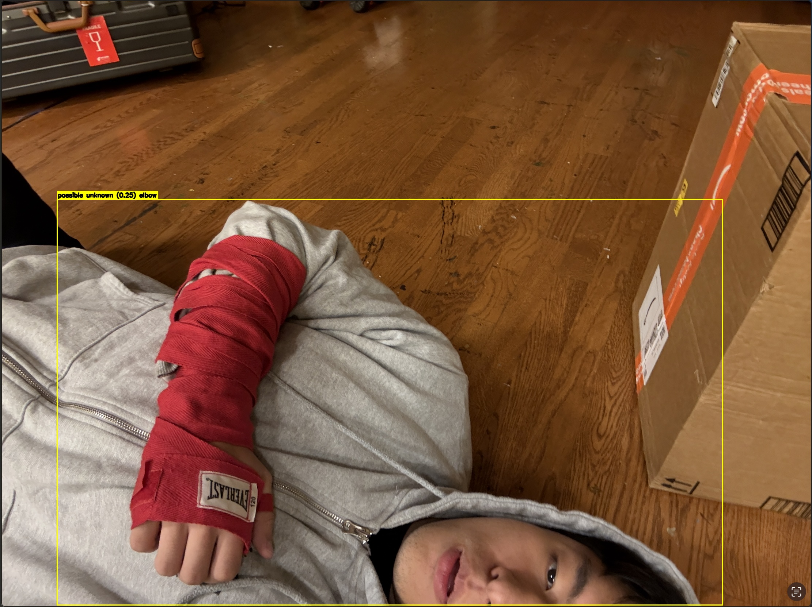

# Triage Assessment Report

> **Generated:** 2026-02-15 04:14:38 UTC
---

## Scene Summary

Automated triage assessment from live video feed. Victim reported: my arm is bleeding, im in pain, rubble fell on me, i think i broke my elbow

---

## Triage Findings

| # | Finding | Body Region | Confidence | Severity | Evidence |
|---|---------|-------------|------------|----------|----------|
| 1 | possible unknown | `elbow` | **0.25** (possible) | low | [crop](evidence/20260214_201437/finding_0_crop.jpg) |

### Evidence Gallery

#### Finding 1: possible unknown — `elbow`

- **Type:** unknown
- **Confidence:** 0.25 (possible)
- **Severity:** low
- **Prompt:** "injury"
- **Signals:** openvocab=0.019, red_ratio=0.1849

| Annotated | Crop |
|-----------|------|
|  |  |

---

## Victim Responses

| Question | Response |
|----------|----------|
| victim_statement | my arm is bleeding, im in pain, rubble fell on me, i think i broke my elbow |
| injury_location | elbow |

---

## Recommended Actions

- **Note:** Possible unknown near `elbow` — low severity, continue observation.

---

## Notes

- Report generated from demo script.

---

## Narrative Summary

Possible unknown observed near elbow (confidence 0.25).

---

> **Disclaimer**
>
> This is triage support and documentation only; not a medical diagnosis. All findings are suspected and must be confirmed by a qualified medical responder.